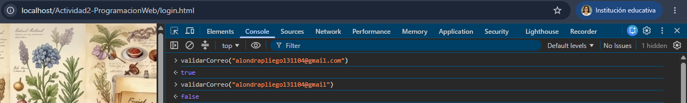
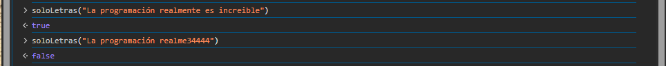
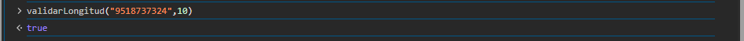
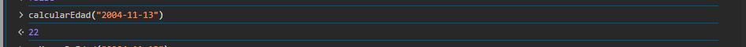
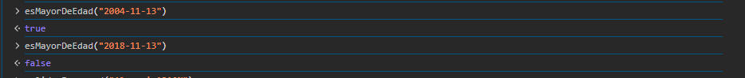
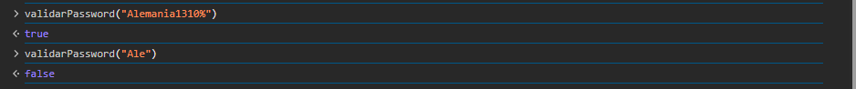
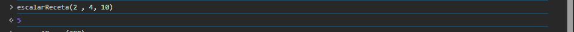
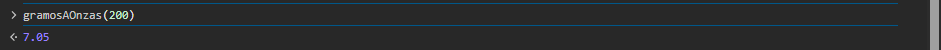

# Actividad 2-Programacion Web
**Alumna**: Pliego Mendez Alondra

Librería JS funcional (sin frameworks, sin componentes visuales) destinada a ser utilizada para la validación de información que generalmente es solicitada dentro de distintos formularios. Además, incluye dos funciones extra enfocadas en resolver problemas comunes de un chef: estandarizar recetas en base a las porciones que se requieran, y convertir unidades de gramos a onzas.
## Instalación
Para la utilización de esta libreria descarga el archivo utileria.js de la carpeta /js de este repositorio e inclúyelo en tu HTML antes de tu propio script:
```html
<script src="js/utileria.js"></script>
```
Nota: Así como en este caso recomiendo el uso de un archivo intermedio .js que conecte con las funciones de la libreria utileria.js y tu archivo .html.
## Ejemplos de uso
### validarCorreo(correo)
Valida que un texto tenga formato de correo electrónico. Regresa `true` o `false`. Utilizado en la validación para iniciar sesión.
```javascript
function validarCorreo(correo) {
    const patron = /^[^\s@]+@[^\s@]+\.[^\s@]+$/;
    return patron.test(correo);
}
```

### soloTexto(texto)
Valida que un texto contenga solo letras (mayúsculas, minúsculas, vocales acentuadas y espacios). Útilizada en el campo de nombre del formulario.
```javascript
function soloLetras(texto) {
    const patron = /^[A-Za-zÁÉÍÓÚáéíóúÑñ\s]+$/;
    return patron.test(texto);
}
```

### validarLongitud(numero, maxLongitud)
Valida que un número (como un teléfono) tenga exactamente la cantidad de dígitos que se le indique, en este caso 10.
```javascript
function validarLongitud(numero, maxLongitud) {
    const texto = String(numero).trim();
    return texto.length == maxLongitud;
}
```

### calcularEdad(fechaNacimiento)
Calcula la edad en años cumplidos a partir de una fecha de nacimiento en formato `AAAA-MM-DD`. 
```javascript
function calcularEdad(fechaNacimiento) {
    const nacimiento = new Date(fechaNacimiento);
    const hoy = new Date();
    let edad = hoy.getFullYear() - nacimiento.getFullYear();
    return edad;
}
```

### esMayorDeEdad(fechaNacimiento)
Valida si una persona es mayor de edad (18 años o más) a partir de su fecha de nacimiento. Puede ser usada para permitir o no la entrada a un sitio. O que lleve a cabo cierta actividad.
```javascript
function esMayorDeEdad(fechaNacimiento) {
    return calcularEdad(fechaNacimiento) >= 18;
}

```

### validarPassword(password)
Valida que una contraseña tenga mínimo 8 caracteres, al menos una mayúscula, una minúscula, un número y un carácter especial.
```javascript
function validarPassword(password) {
    const tieneMayuscula = /[A-Z]/.test(password);
    const tieneMinuscula = /[a-z]/.test(password);
    const tieneNumero = /[0-9]/.test(password);
    const tieneEspecial = /[^A-Za-z0-9]/.test(password);
    return tieneMayuscula && tieneMinuscula && tieneNumero && tieneEspecial && password.length >= 8;
}
```

### escalarReceta(cantidadOriginal, porcionesOriginales, porcionesDeseadas)
Estandariza la cantidad de un ingrediente cuando se quiere aumentar o disminuir el número de porciones de una receta. Creado con el objetivo de facilitar la estandarización en recetas con gran cantidad de ingredientes.
```javascript
function escalarReceta(cantidadOriginal, porcionesOriginales, porcionesDeseadas) {
    if (porcionesOriginales <= 0) return 0;
    const resultado = (cantidadOriginal / porcionesOriginales) * porcionesDeseadas;
    return Math.round(resultado * 100) / 100;
}
```

### gramosAOnzas(gramos)
Convierte una cantidad en gramos a su equivalente en onzas, redondeado a 2 decimales. Es una de las medidas de peso más necesarias en cocina.
```javascript
function gramosAOnzas(gramos) {
    const GRAMOS_POR_ONZA = 28.35;
    const resultado = gramos / GRAMOS_POR_ONZA;
    return Math.round(resultado * 100) / 100;
}
```

## Video de prueba de funcionamiento
https://youtu.be/yD86qDrWnes
## Links
### GitHub Pages
- Formulario + modal: https://alondrapliego.github.io/Actividad2-ProgramacionWeb/
- Login: https://alondrapliego.github.io/Actividad2-ProgramacionWeb/login.html
### GitHub Repositorio
- https://github.com/AlondraPliego/Actividad2-ProgramacionWeb
## Estructura del repositorio
```
/Actividad2-PogramacionWeb
  - README.md
  - index.html
  - login.html
  /css
    - styles.css
  /js
    - utileria.js
    - app.js
  /img
    - fondo.png
```
